# hse23_hw2_chip

## Ссылка
[Colab](https://colab.research.google.com/drive/1V1dPOIwlwswlzqwyqHiAXQbN5m3fJufa?usp=sharing)

## Анализ FastQC

# ENCFF820FVP
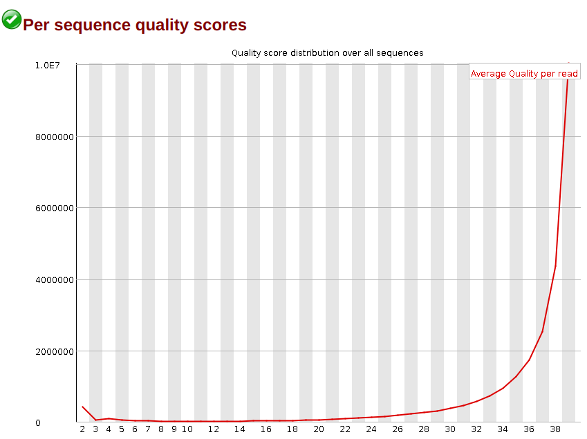
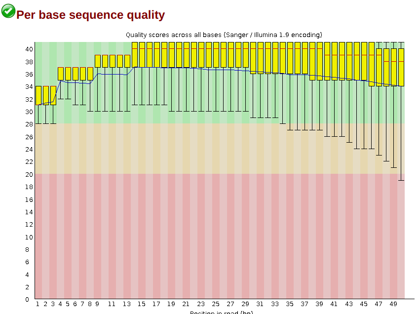
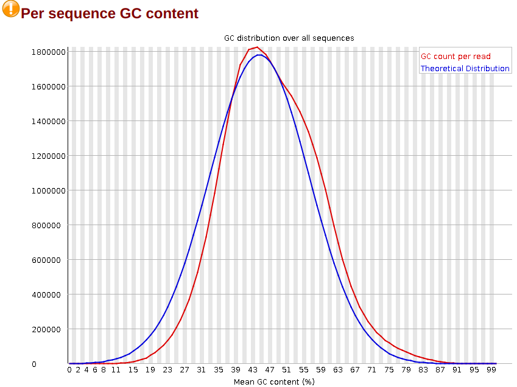
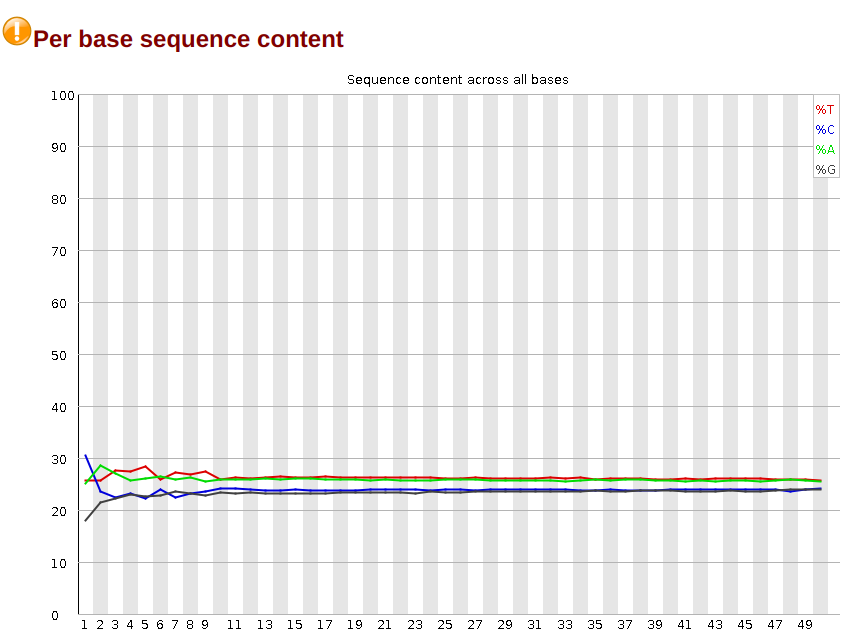

# ENCFF000AWJ
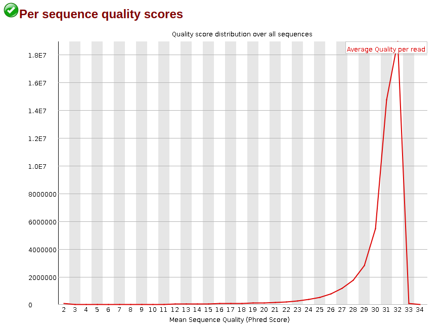
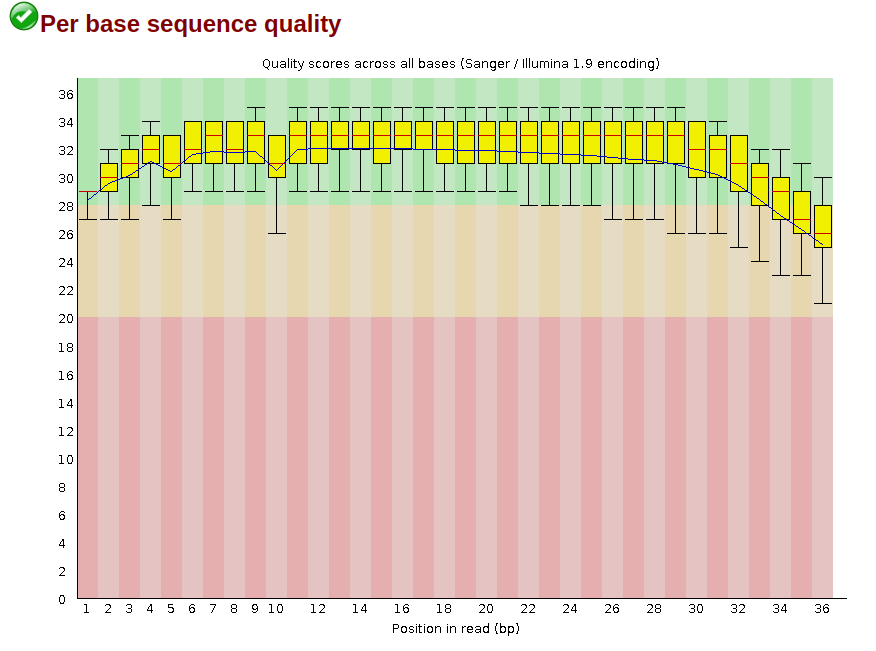
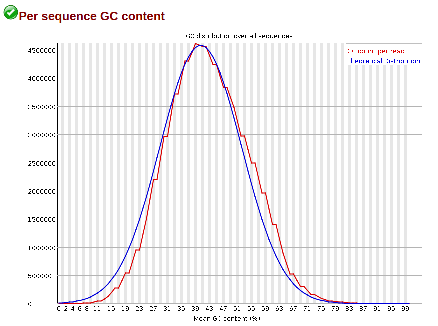
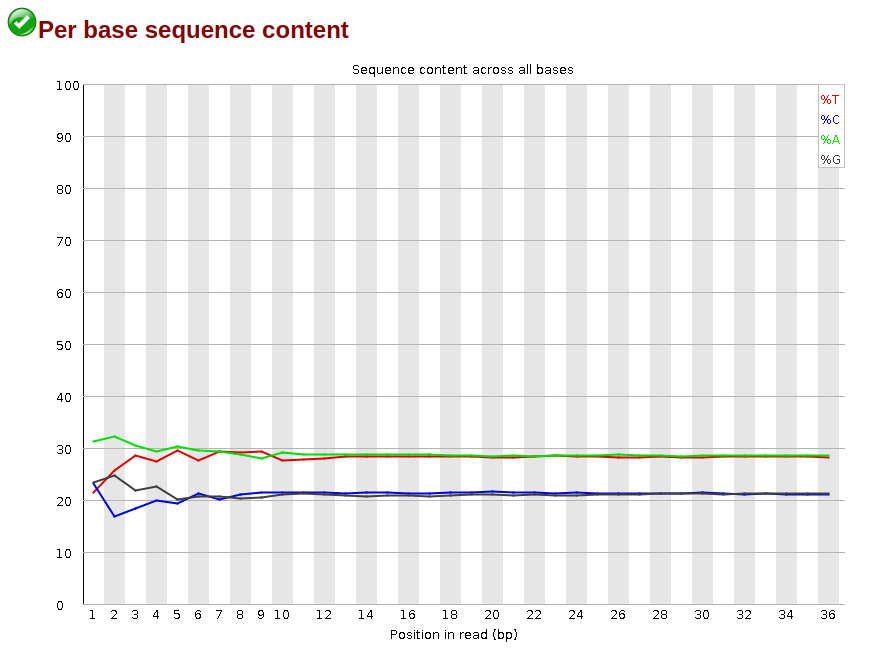

# ENCFF036EGF
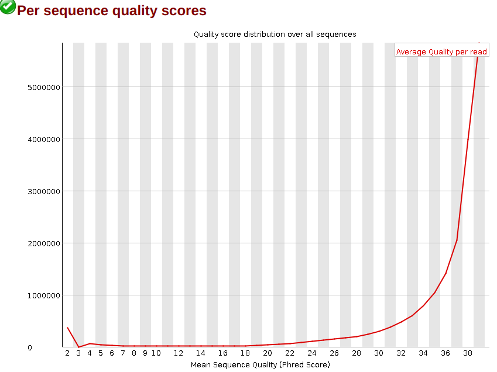
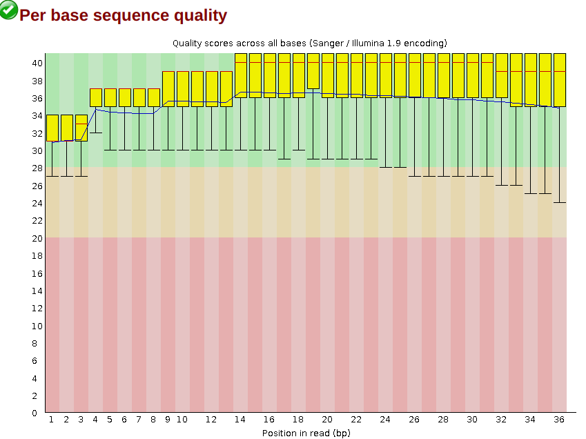
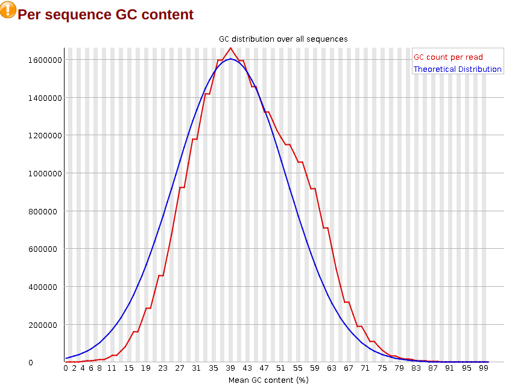
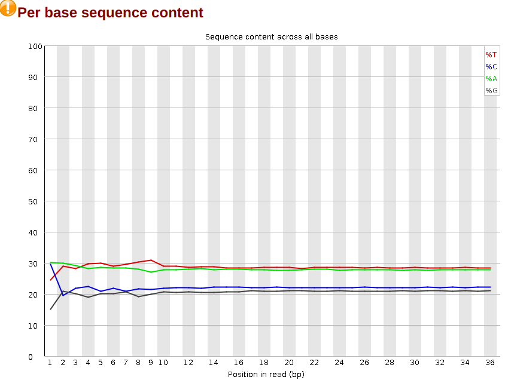

## Таблица со статистикой
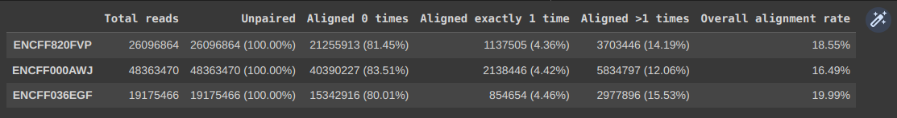
Процент оказался низкий, потому что мы проводили выравнивание ридов на одной из 23 пар хромосом, которая составляет лишь небольшую часть генома человека, откуда ~4.4% выравниваний достаточно хороший результат.

## Диаграммы Венна

# Первая реплика с Encode

# Encode с первой репликой
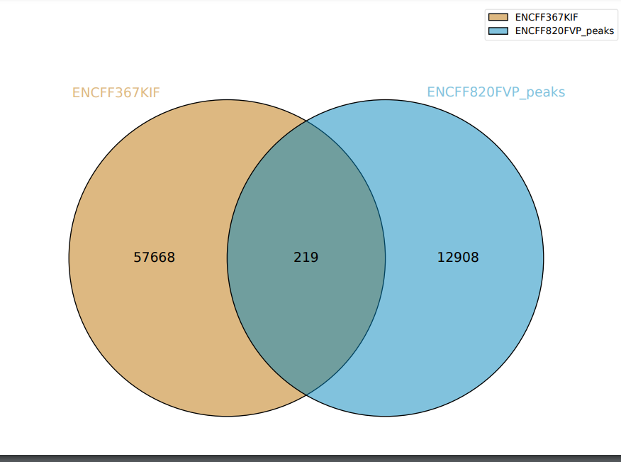
# Вторая реплика с Encode
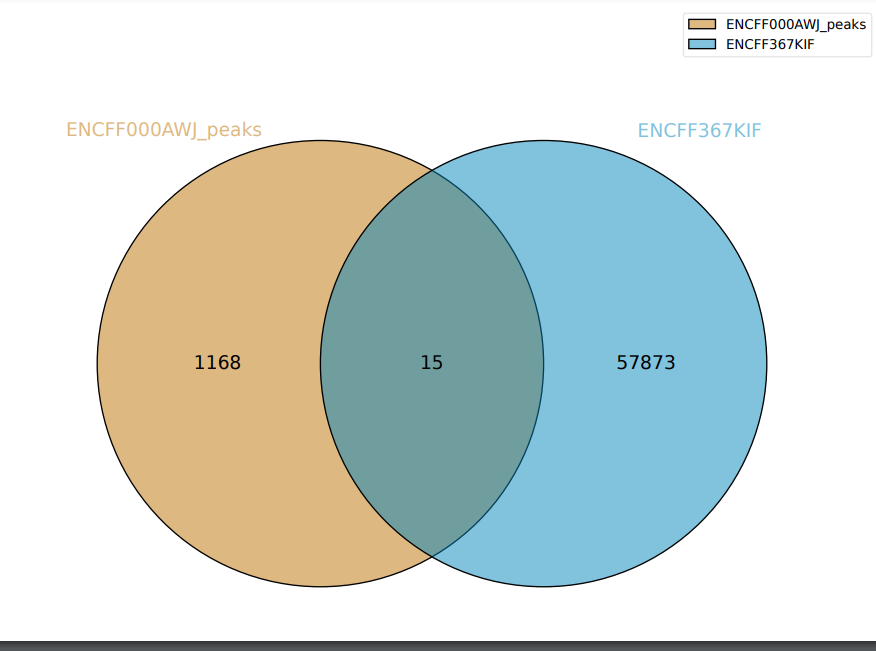
# Encode со второй репликой

Количество пересечений маленькое. Это потому что мы производили выравнивание только по одной хромосоме.

